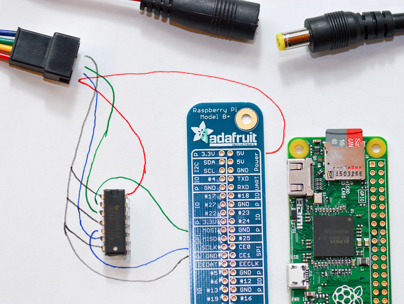
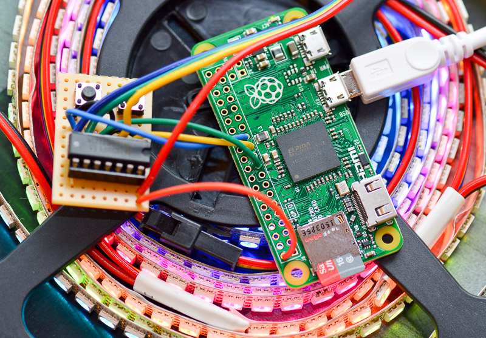

# APA102\_Pi

## Introduction
APA102\_Pi is a pure Python library to drive APA102 type LED strands. It is supposed to work on a Raspberry Pi, and is not tested on any other platform.

APA102 LEDs are typically 5050 type LEDs with an additional driver chip per LED. The driver chip takes care of receiving the desired colour via its input lines, and then holding this colour until a new command is received.

Depending on where these LEDs are bought, they might be called "APA102", "Superled", or "DotStar". They should not be confused with the three-wire WS2812 LEDs, also known as "NeoPixel".

The really nice part about the driver chip is this: Once it has received its own colour command, it forwards any further colour commands from its input to its output lines. This allows to easily chain multiple LEDs together. Colour command #1 lights the first LED, command #2 the next LED, etc. Sending e.g. 300 colour commands lights an entire 5 Meter, 60 LEDs per Meter strip.

## Purpose
The library is designed to take care of the details about sending colour commands. It is supposed to be educational, and is therefore written in Python. The library is fast enough to produce nice colour effects on a 300 LED strand, even though it is running via the Python interpreter. However, if you need something really fast, e.g. to drive a small "display" based on APA102 LEDs with 15 frames per second, then you have to look elsewhere.

## Prerequisites
* A Raspberry Pi, running an up-to-date version of Raspbian (the library is tested with the 2017-09-07 version of Raspbian Stretch Lite).
* If hardware SPI is used: SPI enabled and active (`raspi-config`, Interfacing Options, SPI, Enable); The SPI must be free and unused.
* For software SPI (bit bang mode): Two free GPIO pins
* The Adafruit_Python_GPIO library (https://github.com/adafruit/Adafruit_Python_GPIO) 
* Python 3: Some people tried with Python 2 and reported it working, but I can't vouch for this myself. I used Python 3 for all development and test. Note that you need to install the Adafruit_Python_GPIO with Python 3! If you install with Python 2, then the library is invisible for Python 3 applications.

Ideally, a 10$ Raspberry Pi Zero W is dedicated to the task of driving the LEDs. The connector to the LED stripe can be soldered directly to the correct ports on the board.

## Wiring
The Raspberry Pi is a 3.3 Volt device, and the APA102 LEDs are 5 Volt devices. Therefore it's possible that the 3.3 Volt SPI signal is not being recognized by the LED driver chips. To avoid this risk, use a 74AHCT125 or 74AHC125 level shifter for both the clock and the MOSI signal. You will not damage the Raspberry Pi if you don't use a level shifter, because the Raspberry Pi determines the voltage of MOSI and SCLK.

Without a level shifter, the wiring is very simple:

- LED ground to one of the Raspberry ground pins  
- LED Data to Raspberry SPI MOSI  
- LED Clock to Raspberry SPI SCLK

Note that the "Chip Select" line (CE0 or CE1) is not used. The APA102 chip always accepts data, and cannot be switched off. Therefore, the APA102 strip must be the only SPI device on the Raspberry Pi.

The LED strip uses a lot of power (roughly 20mA per LED, i.e. 60mA for one bright white dot). If you try to power the LEDs from the Raspberry Pi 5V output, you will most likely immediately kill the Raspberry! Therefore I recommend not to connect the power line of the LED with the Raspberry. To be on the safe side, use a separate USB power supply for the Raspberry, and a strong 5V supply for the LEDs. If you use a level shifter, power it from the 5V power supply as well.

Having said this, you *can* power the Raspberry from the same power supply as the LED stripes (instead of using an extra USB power supply). If you decide to do this, make sure to never power the Raspberry Pi from its USB power supply, or you risk that the LEDs try to take power from the Raspberry.

All combined, this is my extremely low-tech wiring diagram:

And here it is, the finished contraption running a "rainbow" program:

This is a Raspberry Pi Zero W with a Phat Beat amplifier on top. The amplifier's "VU meter" is simply a bunch of APA 102 LEDs; They show the "Rainbow" color schema:

Plugged into the USB port is a WLAN stick (nowadays I would rather use a Raspberry Pi Zero W, of course). This way I can reprogram the light show from my desk, even if the strips are installed outside as a Christmas light. Compare this to an Arduino/WS2812 based installation: To reprogram one has to take the Arduino inside, or a laptop outside.

## Video of the installation
Videos can't be embedded yet, so head over to Youtube: [https://youtu.be/N0MK1z8W-1U]()

## Quick setup
Because the Raspberry Pi Zero runs headless, the Raspbian Lite image was used. This image only contains the bare minimum of packages, therefore some packages have be added manually. Of course, you can use the full Raspbian Stretch image and save yourself some of the installation steps.

The more recent Raspbian Lite images can easily be set-up to run headless from the start. After burning the card on a Mac or PC, it will be mounted as "boot". Go to this directory, and create an empty file named `ssh` to enable SSH. On a Mac you would do this: `touch /Volumes/boot/ssh`. To enable and configure WLAN, create a file named `wpa_supplicant.conf`. Its content should be:  

	country=CH
	ctrl_interface=DIR=/var/run/wpa_supplicant GROUP=netdev
	update_config=1
	
	network={
		ssid="Your_SSID"
		psk="Your_Password"
		key_mgmt=WPA-PSK
	}

Of course, use the correct country and ssid/psk. After booting (be patient: The Pi will initially boot twice) you can SSH into the Raspberry Pi: `ssh pi@raspberrypi.local`. The initial password is `raspberry`: Make sure to change it right away!

Then, update your installation (`sudo apt-get update && sudo apt-get -y upgrade`). This is what you then need to do in order to get the library up and running:

- Activate SPI: `sudo raspi-config`; Go to "Interfacing Options"; Go to "SPI"; Enable SPI; Exit exit the tool and reboot  
- Install the git client: `sudo apt-get install -y git`  
- Prepare GIT: `git config --global user.name "John Doe" && git config --global user.email johndoe@example.com`  
- Install Python 3 and some packages required by the Adafruit library: `sudo apt-get install -y python3 python3-dev python3-pip python3-smbus python3-rpi.gpio build-essential`  
- Fetch the Adafruit_Python_GPIO library: `cd /tmp && wget https://github.com/adafruit/Adafruit_Python_GPIO/archive/master.zip && unzip master.zip`  
- Install the library: `cd Adafruit_Python_GPIO-master && sudo python3 ./setup.py install`  
- Create a development directory and change into it: `mkdir ~/Development && cd ~/Development`  
- Get the APA102 Library and sample light programs: `git clone https://github.com/tinue/APA102_Pi.git`  
- You might want to set the number of LEDs to match your strip: `cd APA102_Pi && nano runcolorcycle.py`; Update the number, Ctrl-X and "Yes" to save.  
- Run the sample lightshow: `./runcolorcycle.py`.

## Release history
- 2015-04-13: Initial version
- 2015-12-04: Add documentation
- 2015-12-11: Rewrote the examples, driver itself is unchanged
- 2015-12-17: Fixes for reported problems; Update all of the color samples; Decouple number of steps from number of LEDs
- 2016-03-25: Merged changes from kapacuk: Allow stripes with different color coding than RGB
- 2016-03-27: Merged 'rotate' method from kapacuk; Fixed errors from previous merge
- 2016-12-25: Fixed error related to 'rotate'; Removed annoying messages on console; Added a debug method
- 2017-04-14: Merged pull request #19 from DurandA/master; Cleanup; Update README.MD, No functional changes
- 2017-04-16: Update code to better comply with the Python style guide (PEP 8); Merged pull request from 'jmb'
- 2017-08-26: Tested with Raspbian Stretch; Update Readme.
- 2017-11-05: Exchanged the SPI library to Adafruit_Python_GPIO. This allows to support devices that do not use hardware SPI, for example the Pimoroni Blinkt! or the Phat Beat.
